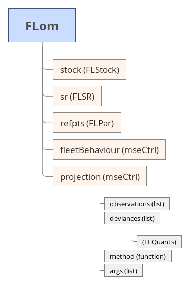
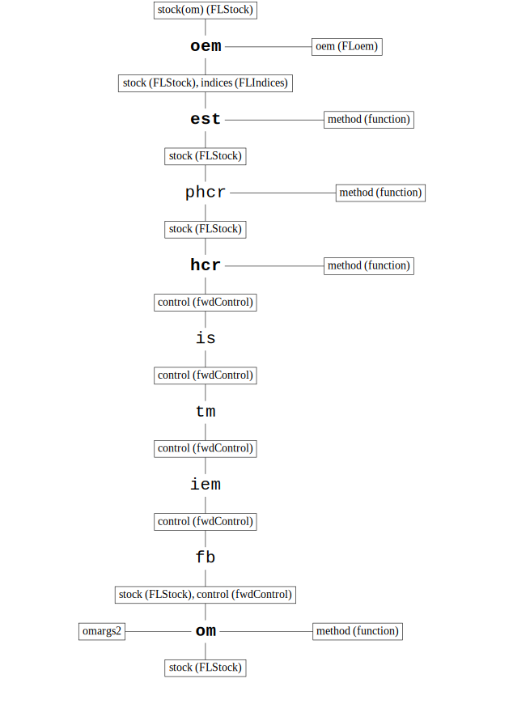

```{r, pkgs, echo=FALSE, message=FALSE}
knitr::opts_chunk$set(collapse = T, comment = "#>",
  fig.align="center")
library(mse)
```

# Introduction

This is an introduction.

# S4 classes

## FLom

```{r FLom, echo=FALSE, out.width='50%', fig.cap="**FLom class**: Structure of the FLom class. Slot name followed by the slot class, in parenthesis."}

```

## FLmse

```{r FLmse, echo=FALSE, out.width='50%', fig.cap="**FLmse class**: Structure of the FLmse class. Slot name followed by the slot class, in parenthesis."}
knitr::include_graphics('diagrams/FLmse.png')
```

## FLoem

## FLiem

## mpCtrl

## mseCtrl

# Functions

## mp()

```{r mp, echo=FALSE, out.width='50%', fig.cap="Workflow of the mp() function."}

```

## performance()

# Extending mse with your own functions

## hcr

## sa

# More information

* You can submit bug reports, questions or suggestions on `mse` at the `mse` issue page ^[<https://github.com/flr/mse/issues>], or on the *FLR* mailing list.
* Or send a pull request to <https://github.com/flr/mse/>
* For more information on the FLR Project for Quantitative Fisheries Science in R, visit the FLR webpage ^[<http://flr-project.org>].
* The latest version of `mse` can always be installed using the `devtools` package, by calling
```{r, devtools, echo=TRUE, eval=FALSE}
	library(devtools)
	install_github('flr/mse')
```

## Software Versions

* `r version$version.string`
* FLCore: `r packageVersion('FLCore')`
* mse: `r packageVersion('mse')`
* **Compiled**: `r date()`
* **Git Hash**: `r system("git log --pretty=format:'%h' -n 1", intern=TRUE)`

## Author information

**Iago MOSQUEIRA**. WUR
**Ernesto JARDIM**. European Commission Joint Research Centre. Ispra. Italy.

# References

